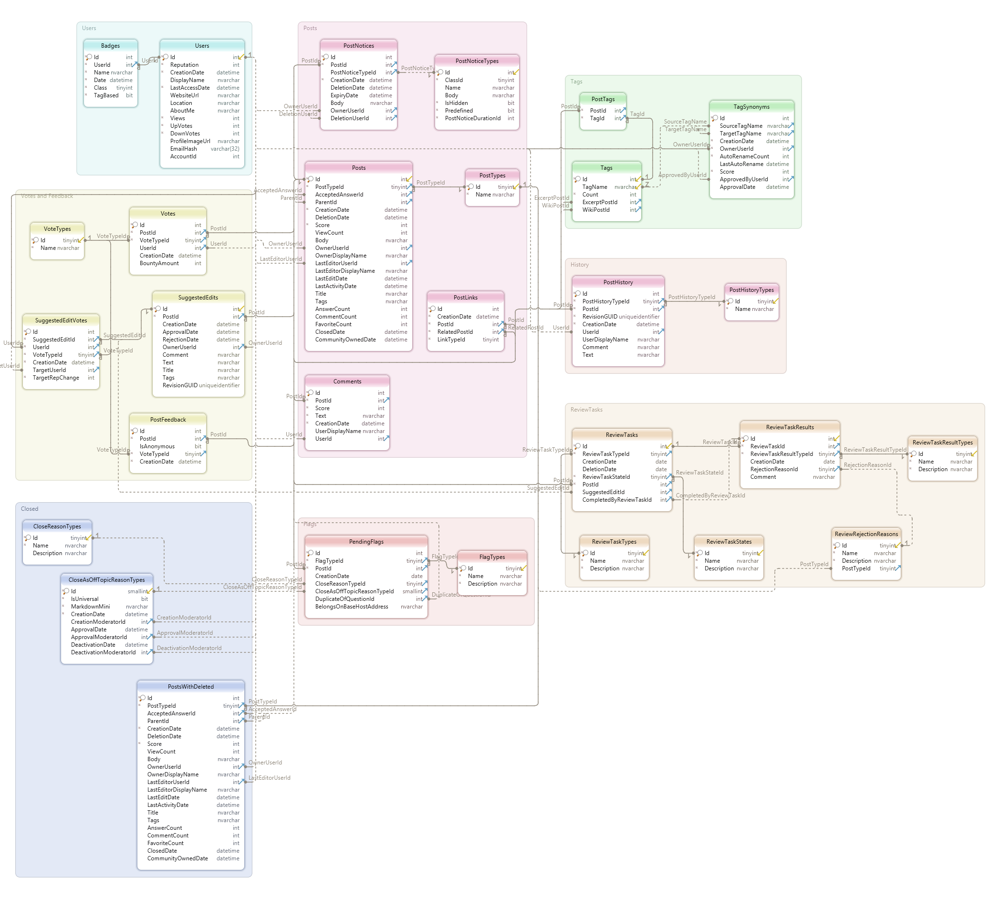

# SEDESchema
A python script for generating an Entity Relationship Diagram for the Stack Exchange Data Explorer Schema

## Stack Exchange Data Explorer Entity Relationship Diagram

## Database Schema Construction Script 

Either in jupyter notebook [info_schema-to-SQL_create_script.ipynb](https://github.com/leerssej/SEDESchema/blob/master/info_schema-to-SQL_create_script.ipynb) file or the converted [info_schema-to-SQL_create_script.py](https://github.com/leerssej/SEDESchema/blob/master/info_schema-to-SQL_create_script.py) file
